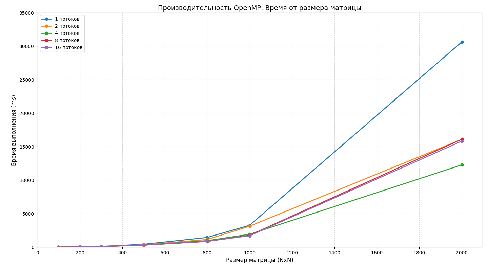

# Лаборатороная работа №2
Программа на C++ была модифицирована добавлением технологии OpenMP. Было произведено исследование зависимости времени выполнения от количества задействованных потоков и размеров матриц.

# Запуск программы
Ввести `python3 run_all.py` в терминал

# Результаты

Я использовал процессор 11th Gen Intel(R) Core(TM) i5-11300H @ 3.10GHz с 4 ядрами.

| Размер | 1 поток | 2 потока | 4 потока | 8 потоков | 16 потоков |
|---| ---| ---| ---| ---| ---| 
| **100x100** | 17.1026 ms | 12.3716 ms | 10.942 ms | 11.4099 ms | 12.3229 ms |
| **200x200** | 48.8237 ms | 43.3438 ms | 40.0687 ms | 40.3188 ms | 40.986 ms |
| **300x300** | 116.266 ms | 101.767 ms | 95.2018 ms | 90.2659 ms | 91.8006 ms |
| **500x500** | 425.049 ms | 350.204 ms | 300.262 ms | 290.986 ms | 299.22 ms |
| **800x800** | 1442.47 ms | 1133.96 ms | 962.421 ms | 847.33 ms | 862.383 ms |
| **1000x1000** | 3258.88 ms | 3127.65 ms | 1918.07 ms | 1764.93 ms | 1695.1 ms |
| **2000x2000** | 30624.7 ms | 16086.8 ms | 12275.8 ms | 16106.5 ms | 15825.2 ms |

# Вывод

Наибольший прирост производительности наблюдается на матрицах большого размера.На малых размерах выигрыш от OpenMP минимален или отсутствует, так как накладные расходы на создание и синхронизацию потоков сопоставимы с временем самих вычислений.

Для данного процессора пик производительности достигается на 4 потоках.Увеличение количества потоков до 8 и 16 не привело к дальнейшему ускорению, а в ряде случаев (например, на размере 2000x2000 при 8 потоках) даже замедлило работу