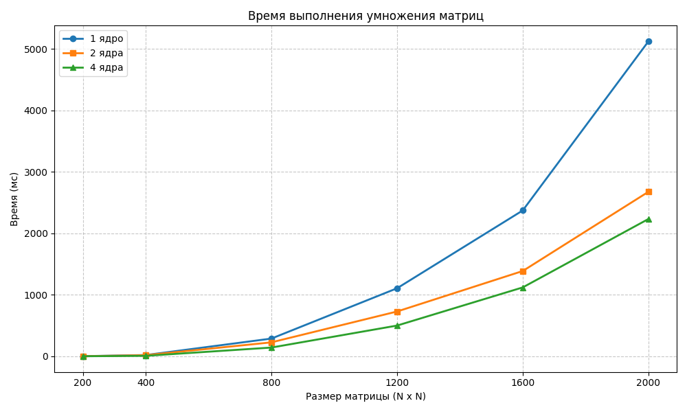

# Лаборатороная работа №3
Программа на C++ была модифицирована добавлением технологии MPI. Было произведено исследование зависимости времени выполнения от количества задействованных ядер и размеров матриц.

# Запуск программы
Ввести `python3 run_all.py` в терминал

# Результаты

Я использовал процессор 11th Gen Intel(R) Core(TM) i5-11300H @ 3.10GHz с 4 ядрами.

| Размер матриц     |  1 ядро |  2 ядра |  4 ядра |
|----------|-----------|-----------|-----------|
| 200      | 2.76       | 1.74       | 1.84       |
| 400      | 21.09      | 18.64      | 8.31       |
| 800      | 288.91     | 227.67     | 143.03     |
| 1200     | 1107.39    | 729.58     | 500.71     |
| 1600     | 2373.64    | 1388.22    | 1121.58    |
| 2000     | 5124.75    | 2677.22    | 2234.71    |

# Вывод

Использование MPI позволило сократить время вычислений для матрицы 2000×2000 с 5.1 с до 2.2 с. На малых размерах (N≤400) ускорение почти не заметно из-за доминирующих затрат на инициализацию процессов и передачу данных. На больших объемах данных 4 ядра дают ускорение в 2.3 раза