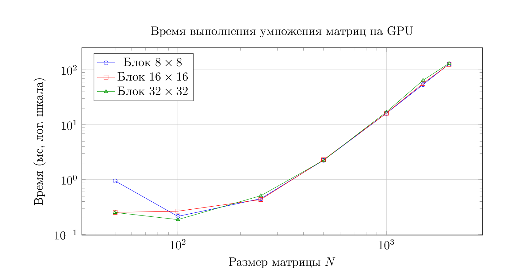

# Отчёт о производительности параллельного умножения матриц с использованием CUDA
**Лабораторная работа №4** **Май 2026 г.**

---

## 1 Введение
В данном отчёте представлены результаты исследования производительности параллельного алгоритма умножения квадратных матриц, реализованного на языке C++ с использованием технологии CUDA. Целью работы является анализ времени выполнения вычислений на графическом ускорителе (GPU) при различных размерах матриц и конфигурациях сетки потоков (размерах блоков).

## 2 Результаты измерений
В таблице 1 приведено время выполнения умножения матриц (в миллисекундах) на GPU для различных размеров матрицы N и размеров блока потоков (blockDim).

### Таблица 1: Время выполнения (мс) при различном размере блока

| N | Блок 8x8 | Блок 16x16 | Блок 32x32 |
| :--- | :--- | :--- | :--- |
| 50 | 0.949 | 0.254 | 0.252 |
| 100 | 0.214 | 0.266 | 0.187 |
| 250 | 0.450 | 0.435 | 0.511 |
| 500 | 2.261 | 2.306 | 2.254 |
| 1000 | 16.138 | 16.274 | 17.095 |
| 1500 | 53.940 | 56.614 | 64.659 |
| 2000 | 127.488 | 126.401 | 131.805 |

---

## 3 Выводы
1. **Производительность:** Использование технологии CUDA обеспечивает колоссальную производительность при умножении матриц большого размера по сравнению с CPU. Матрицы размером 2000x2000 перемножаются приблизительно за 126-131 мс.
2. **Влияние размера блока:**
    * На малых матрицах (N=50) использование блоков 8x8 показало наибольшее время (около 0.95 мс) из-за накладных расходов и недозагрузки мультипроцессоров.
    * Блоки 16x16 и 32x32 на малых матрицах справились в 3-4 раза быстрее.
    * На матрицах большого размера (N >= 1000) конфигурации блоков 8x8 и 16x16 показывают наилучшую и практически идентичную производительность.
    * Блоки размера 32x32 (1024 потока в блоке — максимальный лимит для современных архитектур) демонстрируют небольшое падение производительности на тяжелых матрицах (N=1500, N=2000).

---
